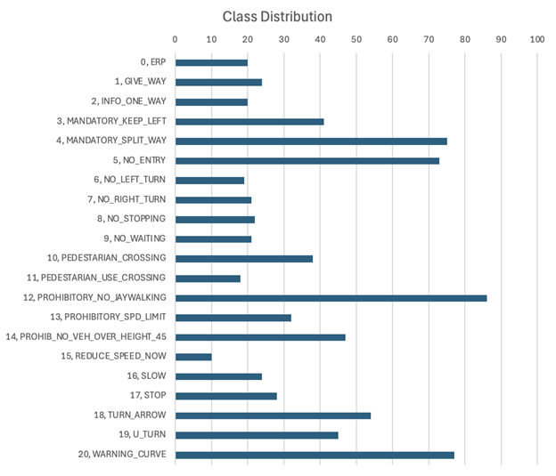

# SG-Road-Signs-Detection

This repository contains the codes used in our 50.035 Computer Vision project.

## Members
- Radhi Priya Janakiraman (1006387)
- Ramita Bharathithasan (1006150)
- Ching Xin Wei (1006381)
- Swarangi Mehta (1005255)

## Models used
- Faster-RCNN ResNet50 by PyTorch
- YOLOv8s by Ultralytics (model weights path: `models/YOLOv8_adamax.pt`)

## Classes


## Preprocessing 
Functions used in preprocessing can be found in `preprocess.py`.

- `exploration/preprocessing.ipynb` and  `exploration/preprocessing_2.ipynb` contains other preprocessing functions that have been tried during our exploration phase.
- `exploration/augment.ipynb` contains augmentation functions that have been explored.

## Training
- `train_rcnn.py` contains the codes and functions used to train the Faster-RCNN model.
- `train_yolo.py` contains the code to train the YOLOv8 model.

## Evaluation
See `evaluate_models.ipynb` for the functions used to evaluate the models.

## Tracking
See `road_signs_tracking.py` for the Back Projection tracking algorithm. Running the following function will produce a video with objects tracked.

To run: 
```
python road_signs_tracking.py -v <directory to video input> -m <directory to model file>
```